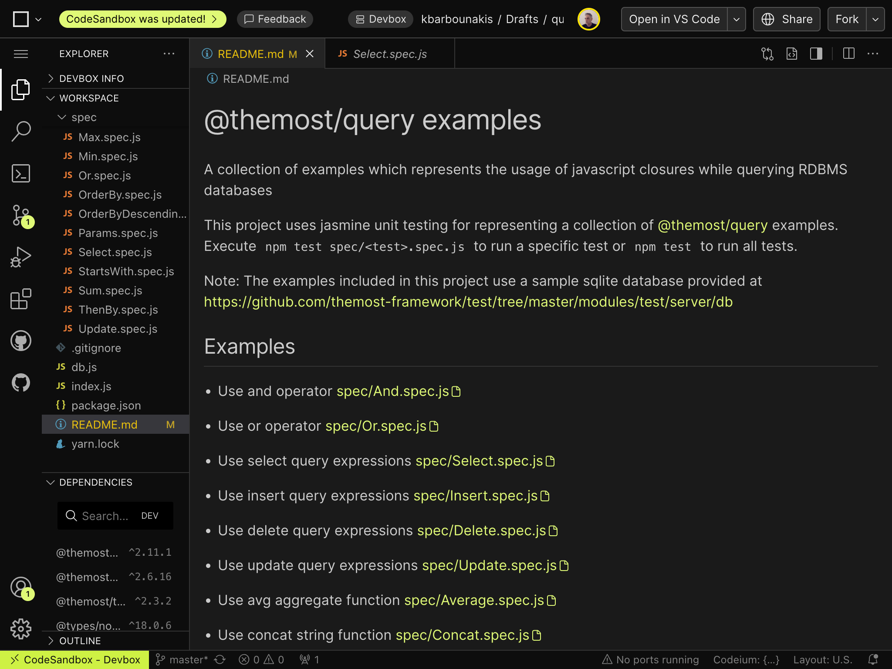

[](https://www.npmjs.com/package/@themost%2Fsqlite)


[](https://github.com/themost-framework/sqlite/blob/master/LICENSE)


[](https://www.npmjs.com/package/@themost%2Fsqlite)


# @themost/sqlite
MOST Web Framework SQLite Data Adapter

License: [BSD-3-Clause](https://github.com/themost-framework/sqlite/blob/master/LICENSE)

## Install

    npm install @themost/sqlite

## Usage

Register SQLite adapter on app.json as follows:

    "adapterTypes": [
        ...
          { "name":"SQLite Data Adapter", "invariantName": "sqlite", "type":"@themost/sqlite" }
        ...
        ],
    adapters: [
        ...
        { 
            "name":"local-db", "invariantName":"sqlite", "default":true,
            "options": {
                database:"db/local.db"
            }
        }
        ...
    ]
}

or create a new instance of `SqliteAdapter` class for connecting to SQLite database.

```javascript
const { SqliteAdapter } = require('@themost/sqlite');
const { QueryExpression } = require('@themost/query');
const db = new SqliteAdapter({
    database: 'db/local.db'
});
const query = new QueryExpression()
    .select(({ id, name, category, model, price }) => ({
        id,
        name,
        category,
        model,
        price,
    })).from('ProductData')
    .where((x) => {
        return x.price > 500 && x.category === "Laptops";
    })
    .orderByDescending((x) => x.price)
    .take(10);
```

Read more about [MOST Web Framework query language provided by @themost/query](https://github.com/themost-framework/query?#themostquery)

Use [query playground project at codesanbox.io](https://codesandbox.io/p/devbox/query-playground-zc8fg9) to learn more about the query language specification of [@themost-framework](https://github.com/themost-framework)



